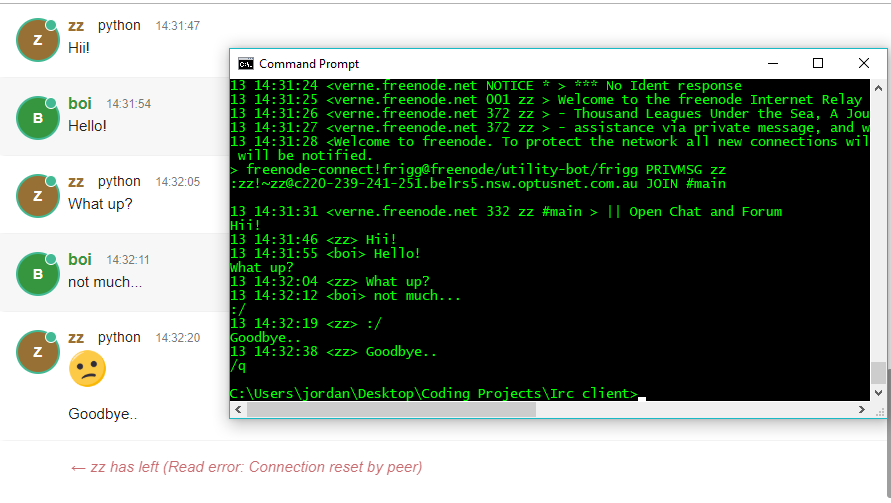

# Irc-Client
Super simple python irc client that can send and receive messages using sockets. Can Join/switch channels using /join #channel-name. Quit using exit.

# Future improvements.
- Add support for commands.
- Clean up ui.
- Allow user to change channels.

# Screenshot

